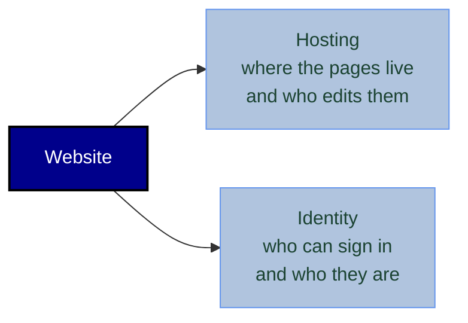

# Hosting and security options

Prepared September 2026 for the Communications Committee and the Board.
Revised September 2026 after the Board confirmed which requirements are compulsory — see §2.

This document sets out realistic options for hosting the DRMCCAA website and protecting
its members-only content, with indicative costs, pros, cons and risks for each.

Prices are indicative, in USD, checked September 2026, and change often — confirm current
pricing before committing. Sources are listed at the end.

---

## 1. Separate the two decisions

The discussion so far has treated "the website" as one choice. It is two, and they can be
answered independently:

Some platforms bundle both (Google Sites, Wix, Wild Apricot). Others let you pick them
separately (a static site behind Cloudflare Access). Bundled is simpler to run; separate is
cheaper and more flexible but means two things to administer.

## 2. What the committees have already asked for

These come from the April 2024 workshop and the committee responses. They rule some options
out before cost is even considered.

The **Status** column records the Board's position as of September 2026, after reviewing the
first version of this document.

| # | Requirement | Where it came from | Status |
|---|---|---|---|
| R1 | The site must know **who** is signed in | Members update their own networking-survey entry | Open to reconsideration |
| R2 | **No second password** for the networking data | Professional Development Committee | Open to reconsideration |
| R3 | Committees edit **their own** pages | Responsibilities model | Open to reconsideration — Communications can edit centrally; open to alternatives |
| R4 | Volunteer-maintainable | Maintenance is a stated top-three issue | **Compulsory** |
| R5 | Little or no recurring cost | Funding is unresolved | **Compulsory** |
| R6 | Must embed Google Calendar, Looker Studio, Google Forms, SoundCloud | Multiple committees | Open to reconsideration — willing to present the information differently |
| R7 | Members are international, many in the EU | Alumni network | **Compulsory** — GDPR applies to the networking survey data |

### What the relaxation changes

The hard constraints are now just three: **free, volunteer-maintainable, and GDPR-safe.**
That has a larger effect than it first appears, and mostly by *closing* options rather than
opening them.

**R5 being compulsory is now the sharpest filter in this document.** It eliminates Wix and
Squarespace (§3B), Wild Apricot (§3D) and self-hosted WordPress (§3E) outright, regardless of
their other merits. It also removes the paid escape route that the first version of this
document relied on if nonprofit validation failed.

**R1 and R2 being negotiable turns out not to help much.** The relaxation exists to make a
single shared password permissible — but the free platform that survives R5 gives per-person
identity as a side-effect, at no cost and with less administration than a password. You end up
satisfying R1 whether you need to or not. See §5.

**R4 and R7 together are the pair that now drives the design.** Both are compulsory, and both
point in the same direction: *do not put the member contact directory on the website.* Holding
personal data creates ongoing obligations — lawful basis, purpose limitation, retention,
a deletion route, a named controller — and ongoing obligations are precisely what a volunteer
committee cannot reliably carry. R6 being negotiable is what makes acting on this possible;
see §8.

---

## 3. The options

### Option A — Google Sites on Google Workspace for Nonprofits

The current test site, formalised.

**How it works.** Google Sites hosts the pages. Access is restricted to named Google accounts
or a Google Group. Members sign in with their own Google account. Editing is drag-and-drop,
and edit rights can be granted per page section to different committees.

**Cost.** Free, if the association is validated as a nonprofit. Google Workspace for Nonprofits
is free for verified 501(c)(3) organisations *or their country equivalents*, validated through
Goodstack (2–14 business days), up to 2,000 users. Without nonprofit status: Business Starter
at standard rates, or run it on a personal Google account with a Group as the allowlist, which
is free but gives you no custom domain mail and no admin console.

**Pros**
- Zero cost and zero hosting to run.
- Per-person identity out of the box, which satisfies R1.
- Same account signs in to Google Forms, Google Calendar and Looker Studio — this is the
  cleanest answer to R2 anywhere on this list.
- Non-technical committee members can edit directly.
- Revoking one person is one line in a Google Group.

**Cons**
- Members must have a Google account, and must be signed into the right one. In practice the
  most common support complaint on Google Sites is people being signed into a personal account
  when the invitation went to a work address.
- Design is constrained. The site will look like a Google Site.
- No real membership features: no renewals, no member directory, no payments.
- Sharing is per-file. Getting the boundary right between public pages and members-only pages
  takes care, and a mis-set share link is the most likely way this leaks.

**Risks**
- *Nonprofit validation may fail or lapse.* Alumni associations are not automatically eligible,
  and re-validation is periodic. Check eligibility before building on it. **This is no longer a
  blocker:** Google Sites is free on any ordinary Google account, a custom domain can be
  connected from a personal account, and a Google Group works as the allowlist without
  Workspace. Losing nonprofit status costs you custom `@drmccaa` mail, the admin console and
  pooled storage — not the website. See §8.
- *Account ownership.* If the Workspace is created under one person's identity, that person
  effectively owns the association's website and mail. Must be an association-owned account
  with at least two super-admins.

---

### Option B — Website builder with a members area (Wix or Squarespace)

**How it works.** A hosted site builder with a built-in member login. Members register or are
invited, get their own account, and specific pages are marked members-only.

**Cost.** Wix paid plans run roughly $17–$159/month billed annually; the members area itself is
included without extra charge unless you need payments or bookings, which push you to Core or
above. Squarespace is comparable, though member areas there have historically been a paid add-on.
Budget **$200–$400/year**.

**Pros**
- Much better looking than Google Sites, with real design control.
- Per-person accounts, satisfying R1.
- Genuinely easy for non-technical editors, and per-page access control is a checkbox.
- One vendor, one bill, one support line.

**Cons**
- Recurring cost with no free tier that includes the members area on a custom domain.
- The Wix member identity is *not* a Google identity, so it does not unlock an embedded Looker
  Studio report or a Google Form. R2 is only half-solved — see §4.
- Content is locked into the platform. Migrating away later means rebuilding.

**Risks**
- *Funding continuity.* A subscription needs someone to keep paying it. A lapsed card takes the
  site down, and volunteer treasurers change.
- *Note on the site-wide password feature.* Wix also offers one password for the whole site.
  That is a different, much weaker mechanism than the members area, and it fails R1. If Wix is
  chosen, it must be the members area, not the site password.

---

### Option C — Static site behind Cloudflare Access

The technical-but-cheap option.

**How it works.** The site is built as static pages (GitHub Pages, Cloudflare Pages or Netlify)
and Cloudflare Access sits in front of it. A visitor hits the site, Cloudflare asks for their
email, sends a one-time PIN, and only lets them through if their address is on the allowlist.
No member accounts, no passwords to manage — just a list of approved email addresses.

**Cost.** Hosting free. Cloudflare Zero Trust is **free up to 50 users**, then $7/user/month.
Domain ~$10–20/year. So **effectively free under 50 members**, and roughly $4,200/year at 50+
users — which is the cliff that matters here, because an alumni association will pass 50.

> Worth checking carefully: the 50-seat limit counts *active authenticating users*, and a large
> alumni association will exceed it. That single fact may disqualify this option, so confirm the
> current limit and the member count before pursuing it.

**Pros**
- Per-person identity via email one-time PIN, with no Google account required and no password
  for anyone to lose. This is the lowest-friction sign-in on the list.
- Free at small scale, and completely under association control.
- Fast, and nothing to patch.
- Access logs show who opened what, which is real accountability for sensitive data.

**Cons**
- **Fails R3 and R4.** Committees cannot edit a static site without a technical workflow. This
  is the option's fatal flaw for a volunteer organisation, unless a CMS is added on top — which
  adds cost and complexity back.
- Needs someone comfortable with DNS and Git. When that person leaves, the site freezes.
- Note that GitHub Pages cannot be made private except on GitHub Enterprise Cloud, so the
  privacy comes entirely from the Cloudflare layer, not the host.

**Risks**
- *Key-person dependency,* the single largest risk in this document for a volunteer body.
- *Cost cliff at 50 users,* as above.

---

### Option D — Association management platform (Wild Apricot and similar)

**How it works.** Purpose-built software for membership organisations: member database, member
accounts, event registration, email, payments and a website, all in one.

**Cost.** Wild Apricot starts around **$63/month** (about $53/month if pre-paid for two years) for
100 contacts, rising to roughly **$140/month at 500 contacts**. Budget **$750–$1,700/year**
depending on membership size.

**Pros**
- Solves problems the other options do not: a real member directory, renewals, event
  registration with capacity limits, and payment collection.
- Per-person accounts with roles, comfortably satisfying R1.
- Members can maintain their own profile — which is close to the "member profiles" nice-to-have
  and overlaps substantially with the networking database.
- Built for exactly this kind of organisation, so the workflows match how a committee thinks.

**Cons**
- By far the most expensive option, and the cost scales with the thing you want to grow.
- Considerable overkill if the association does not collect dues.
- The bundled website builder is the weakest part of most of these products.

**Risks**
- *Cost scaling.* The price rises as membership grows, so success makes it more expensive.
- *Funding.* This option only works if there is a dues or donation model behind it. It makes
  the funding question urgent rather than deferrable.

---

### Option E — Self-hosted WordPress with a membership plugin

**How it works.** Shared hosting, WordPress, and a membership plugin for gated content.

**Cost.** Hosting $5–15/month, membership plugin $150–250/year, domain $15/year. Roughly
**$250–430/year**, plus the unpriced cost of someone's time.

**Pros**
- Maximum flexibility, full data ownership, no platform lock-in.
- Familiar editing interface for many people.
- Fine-grained roles map well onto per-committee editing.

**Cons**
- **You own the security.** WordPress and its plugins need patching, and unpatched membership
  plugins are a well-known route to data exposure. This is an ongoing obligation, not a setup task.
- Needs a genuinely technical volunteer, indefinitely.

**Risks**
- *This is the only option where a lapse in attention becomes a breach rather than just staleness.*
  Given that the site holds personal data on alumni, and that the association's own documents
  list maintenance as an unsolved problem, this combination is hard to recommend.

---

### Option F — Do less, and gate only what actually needs gating

Not a platform. A different scoping of the problem, worth costing because it may beat all of the above.

**How it works.** Make the site public. Put the association overview, committees, contacts,
calendar, podcast, book club and public resources out in the open, where they need no protection
at all. Leave the networking survey data where it already is, behind whatever access control the
Professional Development Committee already uses, and link to it.

**Cost.** Free to ~$200/year depending on host. No identity layer at all.

**Pros**
- Eliminates the hardest problem instead of paying to solve it.
- Removes the biggest GDPR exposure, because the site never holds personal data.
- Doubles as recruitment: prospective members and the wider field can see the association exists.
- Much of the wish list — calendar, podcast, book club, committee info, resources, newsletter
  archive — is not actually confidential.

**Cons**
- Does not satisfy R1 or R2; it sidesteps them. The networking database keeps its separate
  password, which is precisely what the Professional Development Committee asked to be rid of.
- Some members may be uncomfortable with any association material being publicly indexed.

**Risks**
- *Deferral, not resolution.* The identity question returns the moment anyone wants member
  profiles or a job board.
- Content posted publicly is indexed and cached. Assume anything published is permanent.

---

## 4. The embedded-content caveat that affects every option

Several of the wish-list items are embeds: Google Calendar, a Looker Studio report, Google
Forms, SoundCloud. **Putting an embed behind your site's login does not protect the embedded
content.** The embedded service applies its own access rules. Two consequences:

- If a Looker Studio report is shared with "anyone with the link", the link works whether or not
  the person got it from behind your login. The site's gate is decorative in that case.
- Conversely, if the report is restricted to named Google accounts, members will be prompted to
  sign in to Google *again* — which is exactly the second password the committee objected to.

This is why **Option A is unusually strong on R2**: when the site identity and the embedded-tool
identity are the same Google account, the problem disappears. With any non-Google platform, the
realistic answer is either to accept a second sign-in for the sensitive report, or to migrate
that data into the platform itself.

## 5. Scenario: one shared password plus external forms

This came up in discussion and is the most likely proposal to be raised at the meeting, so it
is worth costing properly rather than dismissing.

**The proposal.** Protect the whole site with a single shared password. Members have no
accounts. Anyone who needs to update their networking-survey information does it through a
form, which a committee member reviews and applies.

### What it genuinely fixes

R1 — the site must know who is signed in — exists *only* because members need to edit their own
entry. Move that to a form and the requirement disappears. The site no longer needs to know who
anyone is.

This is a real simplification, not a dodge. It also matches how the association already works:
the April 2024 notes describe committees sending content to Communications to publish.

Two caveats on the form half:

- **An open form cannot tell who is submitting.** Anyone with the password could submit an
  update in someone else's name, or add a fabricated entry. Low likelihood in a trusted
  community, but it means every submission needs human review before it goes live — and that
  work lands on the Professional Development Committee.
- **Requiring a Google sign-in on the form** fixes that, and is free. But it reintroduces
  per-person identity at the form rather than at the site. That is a perfectly reasonable
  answer; just note that identity has been moved, not avoided.

### What the shared password costs you

It is easier to set up and to explain. It is not more secure. Its real failure mode is not
attackers, it is **drift**: the password ends up in the alumni WhatsApp group, gets forwarded to
a friend doing research, sits in an email chain from two years ago. There is no breach event,
just gradual loss of meaning. Concretely:

- You cannot revoke one person's access without changing it for everyone.
- You cannot tell who accessed what, so you cannot demonstrate anything after the fact.
- Rotation means emailing the whole membership, which in practice means it never happens.

Set against that, it does buy the main thing "not public" means to most associations: the site
stops being indexed by search engines and stops being casually discoverable. That is worth
something, and it is worth being clear that it is the thing you are actually buying.

### It works or fails on one question: what sits behind it

| Fine behind a shared password | Not fine behind a shared password |
|---|---|
| Calendar, podcast, book club, newsletter archive, committee internals, resources, blog | The networking database and any alumni contact details |

The left column is *"don't index this publicly"* rather than *"this is confidential"*. A shared
password is a proportionate control for it.

Putting the networking data behind the same password **widens** access to personal data, from
"people who were sent the survey password once" to "anyone who has ever held the site password".
That is weaker than the status quo, and hard to defend under GDPR because you cannot show who
had access.

So the workable version still has two passwords — but only one of them is used regularly, and
the rarely-used one guards the only genuinely sensitive thing. The Professional Development
Committee's request (R2) is not met; it is consciously traded away.

### The consequence that changes the platform choice

**Google Sites has no shared-password mode.** Its access control is Google accounts and Groups,
or fully public. There is no middle setting.

Choosing "one password for the whole site" therefore rules out the free option in §3A. With R5
compulsory, it does *not* point at Wix — Wix is out on cost. It points instead at the free tier
of a lesser builder: Framer's free plan includes password protection but caps you at 1,000
visitors a month; SITE123 and Canva offer similar, with platform branding and a subdomain.

So the route is possible for free. It is just a downgrade: you lose the Google integration and
gain nothing, because the thing a shared password is meant to save you — running member
accounts — is already free and lower-effort as a Google Group.

### A middle option with the same benefit

If the real goal is *less administration* rather than a password specifically, there is a better
version of the same instinct: **an email one-time PIN, or a Google Group allowlist**. Members
receive a code or use the account they already have. Nothing to remember, nothing to leak,
revocable per person, and no member-account administration to run.

Counter-intuitively, **a Google Group allowlist is easier to run than a shared password over
time.** You never rotate it, members never forget it, and adding or removing someone is one
line. The "shared password is simpler" intuition holds for the first week and not for the next
five years.

### Verdict

**Not recommended, now that R5 is compulsory.** R1 being relaxed makes a shared password
*permissible*, but it was never the obstacle — cost is. Under a free-only constraint the shared
password buys you a weaker platform, a visitor cap, no Google integration and a secret that
decays, in exchange for avoiding an administrative task that a Google Group already does for
nothing.

The instinct behind it is sound and worth keeping: **avoid running member accounts.** A Group
allowlist satisfies that instinct better than a password does.

## 6. Risks that apply whatever you choose

| Risk | Why it matters here | Mitigation |
|---|---|---|
| **Key-person dependency** | Domain, hosting account and billing often sit with one volunteer. Their departure can lose the site entirely. | **Partly settled:** the Communications Committee holds responsibility, with a named main administrator and a handover when the role changes. Association-owned accounts, a shared password manager and the domain registered to the association remain necessary, and a break-glass backup is still open. See [Website ownership and handover](website-ownership.md). |
| **Content staleness** | Already identified as a top-three issue. A stale site is worse than none. | Launch small. Prefer linking and embedding over rebuilding. Name individuals, not committees, as owners. |
| **GDPR / personal data** | The networking survey holds contact details for EU-resident alumni. | Collect the minimum, state a purpose, get explicit consent for anything shown to other members, and have a route to delete on request. Keep the survey data in one place, not copied across tools. |
| **The allowlist only ever grows** | Nobody resigns from an alumni association, so the approved list is never pruned and slowly diverges from reality. | Decide in advance what removes someone, and review the list annually. |
| **Funding lapse** | Any paid option dies quietly when a card expires. | Annual pre-payment from association funds, on an association payment method, not a personal card. |
| **Over-scoping** | The wish list is roughly 15 pages. Each one is a maintenance commitment. | Treat the phase-2 flags as binding. |

## 7. Comparison

| | A. Google Sites | B. Wix / Squarespace | C. Static + Cloudflare | D. Wild Apricot | E. WordPress | F. Public only | G. Shared password + forms (§5) |
|---|---|---|---|---|---|---|---|
| **Cost/year** | $0 | $200–400 | $0 (<50 users) | $750–1,700 | $250–430 + time | $0–200 | $200–400 (needs Wix) |
| **Per-person identity (R1)** | Yes | Yes | Yes | Yes | Yes | No | No — moved to the form |
| **Solves the second password (R2)** | Yes | Partly | No | Partly | Partly | No | No — traded away |
| **Committees self-edit (R3)** | Yes | Yes | No | Yes | Yes | Depends | Yes |
| **Volunteer-maintainable (R4)** | High | High | Low | High | Low | High | Medium — manual update loop |
| **Design quality** | Low | High | High | Medium | High | Varies | High |
| **Security burden on us** | Minimal | Minimal | Low | Minimal | **High** | None | Low, but password drift is permanent |
| **Main risk** | Nonprofit eligibility | Funding continuity | 50-user cliff, key person | Cost scaling | Patching lapse | Defers the problem | Sensitive data ending up behind the shared password |
| **Survives the compulsory three?** | **Yes** | No — R5 | No — R4 and R5 | No — R5 | No — R4, R5, R7 | **Yes** | No — R5 in practice |

Applying R4, R5 and R7 as hard filters leaves **Option A** and **Option F**, which are not
really rivals: F is a scoping decision that can be applied to A. That combination is the
recommendation below.

Option C deserves a note, because relaxing R3 appeared to revive it. It does not survive: R4
still fails it, because a static site needs a technical volunteer indefinitely and freezes when
that person leaves, and R5 fails it a second time, because Cloudflare Access is free only to
50 users and an alumni association will pass that.

## 8. Recommendation

**Google Sites with a Google Group allowlist, scoped public-first, with the member contact
directory kept off the website entirely.**

Three parts, in order of how much they matter.

### 8.1 Split the networking data in two

This is the most valuable change available, and it is only possible because R6 was relaxed.
The networking survey currently mixes two things with completely different risk profiles:

| | What it is | Where it goes | Why |
|---|---|---|---|
| **The aggregate picture** | "31 alumni working on early warning across 14 countries" — counts, themes, a map with no names | **Public page.** A static chart or image, refreshed once or twice a year by Communications | Not personal data, so no GDPR obligation, no gate, and nothing to maintain between refreshes |
| **The contact directory** | Names, employers, email addresses, individual survey responses | **Stays off the website.** Keep it where it already lives, with its own access control, and link to it from the members' area | Personal data, so it carries obligations. Keeping it in one system means one place to honour a deletion request |

This serves the "one-stop shop" purpose better than a gated interactive tool that members have
to sign in to reach — the aggregate picture is the part most people actually want to see, and
making it public also makes the association legible to the wider field.

It is also the single largest reduction in both maintenance burden (R4) and compliance exposure
(R7) available anywhere in this document. R2 is not satisfied — there is still a second sign-in
for the directory — but R2 is now negotiable, and this is the trade it was relaxed for.

### 8.2 Google Sites, with or without nonprofit status

Free, needs no technical volunteer, and gives per-person access control as a side-effect rather
than as a cost. Editing is drag-and-drop, so R3 is satisfied whether committees edit their own
pages or Communications does it centrally.

**Nonprofit validation is no longer a precondition.** The first version of this document treated
it as decisive, because failure meant falling back to paid Wix. With R5 compulsory that fallback
is gone — but it is also unnecessary. Google Sites is free on an ordinary Google account, a
custom domain can be connected from a personal account, and a Google Group serves as the
allowlist without Workspace.

So: **pursue nonprofit validation, but do not wait for it.** What it adds is custom `@drmccaa`
mail, an admin console and pooled storage — all worth having, none of them the website.

### 8.3 Keep the gated area small

Put the calendar, podcast, book club, committee information, resources and newsletter archive on
the public side. None of it is confidential, and every gated page is a page someone has to
maintain *and* a reason for a member to hit a sign-in wall.

The association's earlier position was that the site "cannot be public". That was a reasonable
default, but it is worth testing against the relaxed requirements: with the contact directory
kept off the site entirely, there may be very little left that genuinely needs a gate. Whatever
does remain — anything members would not want indexed by search engines — sits behind the Group
allowlist at no extra cost.

### What this leaves unresolved

R2 is consciously traded away: members will sign in twice to reach the contact directory. If the
Professional Development Committee finds that unacceptable after all, the answer is to move the
directory into Google's own tooling — a Sheet or Looker Studio report restricted to the same
Google Group — so one identity covers both. That is more work to set up and keeps personal data
under the association's control rather than a third party's, which is a genuine trade-off in
both directions.

## 9. Decisions needed to proceed

The September 2026 requirements review answered most of the original list. Two questions remain,
and only the first blocks anything.

1. **Does the Professional Development Committee accept the split in §8.1** — an aggregate,
   public, name-free view of the network on the website, and the contact directory kept off it?
   This is the one decision the design depends on.
2. **Is there a break-glass backup for the administrator account?** The ownership question is
   otherwise settled — the Communications Committee holds responsibility, with a named main
   administrator and a handover on change of role. What remains is cover for an *unplanned*
   departure, which a handover by definition does not provide. See
   [Website ownership and handover](website-ownership.md) §2.

Worth doing in parallel, blocking nothing:

3. Apply for nonprofit validation through Goodstack. Useful if it succeeds, survivable if it
   does not (§8.2).
4. Agree who maintains the aggregate network view, and how often it is refreshed.

### Closed by the requirements review

| Question | Answer |
|---|---|
| Is there any budget? | No — R5 is compulsory. Eliminates Wix, Wild Apricot and WordPress. |
| Does the association collect dues? | Not relevant now; only mattered for Wild Apricot. |
| How many alumni get access? | Only mattered for Cloudflare Access, which R4 and R5 rule out. |
| Is a second sign-in acceptable? | Yes — R2 is negotiable, and §8.1 depends on it. |
| Is nonprofit validation make-or-break? | No — Google Sites is free without it (§8.2). |
| Should we use one shared password? | No — it costs more and achieves less than a Group allowlist (§5). |

This list is the canonical one. The *Open questions* page in the mock-up repeats it for use in
the room — if a decision is made, update it here first.

---

## Sources

Pricing and platform facts checked September 2026.

- [Cloudflare Zero Trust free plan limits and pricing](https://zerometric.net/research/cloudflare-zero-trust-free-plan-limits-2026/)
- [Cloudflare Access pricing 2026](https://costbench.com/software/ztna/cloudflare-access/)
- [Google Workspace for Nonprofits](https://www.google.com/nonprofits/offerings/workspace/)
- [Google for Nonprofits eligibility and validation, 2026](https://stackforgood.net/guides/google-for-nonprofits/)
- [Wix pricing 2026](https://www.websitebuilderexpert.com/website-builders/wix-pricing/)
- [Wix paid plans and member areas](https://www.zentus.agency/post/wix-paid-plans-and-member-areas)
- [Wild Apricot pricing 2026](https://toolradar.com/tools/wild-apricot-membership/pricing)
- [GitHub Pages site visibility and plans](https://docs.github.com/en/enterprise-cloud@latest/pages/getting-started-with-github-pages/changing-the-visibility-of-your-github-pages-site)
- [Netlify Identity status, February 2026](https://www.netlify.com/blog/auth0-extension-identity-changes/)
- [Using a custom domain with Google Sites](https://support.google.com/sites/answer/9068867?hl=en)
- [Connecting a custom domain from a personal Google account](https://www.steegle.com/google-sites/how-to/assign-custom-url-domain-personal)
- [Free website builders with password protection, 2026](https://softpicker.com/best-free-website-builders/)
