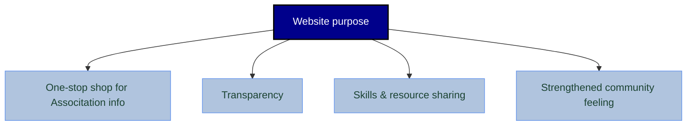

# DRMCCAA Website

This repository is for the planning of a website for the DRMCCA Alumni Association. 

## History

The idea of a website is not new, but it has never been fully actualized. In 2024, we started planning what needs the website might fulfill and how it can provide value to the association.

From these initial planning sessions and communication with other committees, the Communications Committee began drafting how the structure/pages for the website might look:

The latest development is that a test site has been created by Jessica (Co-chair) in Google Sites, and we are reviewing if this is appropriate for us.

## Some issues

Our main issues have been:
* Security - how do we make the website accessible but proteced?
* Maintenance - how do we make sure that the website is properly maintained and remains useful?
* Costs - if we host a website with proper authentication, how do we fund it?

These three are examined in [Hosting and security options](Docs/hosting-and-security-options.md), which compares seven routes on cost, risk and how much work each one puts on volunteers.

It may be necessary to reconsider which requirements are needed and which can be changed. Please look at heading 2 in [Hosting and security options](Docs/hosting-and-security-options.md) to see the committee requirements.

## What is in this repository

| | |
|---|---|
| [Docs/prototype/](Docs/prototype/) | A clickable draft of the site, to be used as inspiration rather than as a finished design. Open `index.html` in a browser — no install, no build step. It implements the structure sketched above, simulates the members' gate, and can show or hide the outstanding planning questions. See [its README](Docs/prototype/README.md) for how to use it in a meeting. |
| [Docs/hosting-and-security-options.md](Docs/hosting-and-security-options.md) | Hosting and security options compared, with indicative costs, pros, cons and risks. Ends with the decisions needed before we can proceed. |
| [Docs/website-ownership.md](Docs/website-ownership.md) | Who is responsible for the site, the register of accounts and domains it depends on, and the checklist to run when the administrator role changes hands. |
| [Docs/Meetings/](Docs/Meetings/) | Notes from planning sessions. |
| [Docs/src/](Docs/src/) | Diagrams and workshop outputs referenced above. |

Neither the mock-up nor the options document commits us to anything. Both exist so the Board and the committees can react to something concrete rather than to a description.

## Where we are

The Board has confirmed which requirements are compulsory — the site must be free to run, maintainable by volunteers, and safe to hold under GDPR. That narrows the field to Google Sites with a Google Group access list, scoped so that most of the site is public and the member contact directory stays off it entirely.

Responsibility sits with the Communications Committee, with a named main administrator and a handover when the role changes.

Two decisions remain, tracked in [§9 of the hosting and security document](Docs/hosting-and-security-options.md#9-decisions-needed-to-proceed): whether the Professional Development Committee accepts separating the public, name-free view of the network from the contact directory, and whether we set up a break-glass backup for the administrator account.
